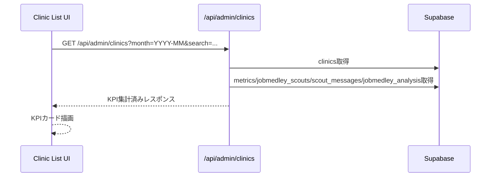

# Design Document: clinic-list-enhancement

## Overview
クリニック一覧画面に7KPIを媒体横断で表示し、一覧だけで採用状況の比較ができるようにする。検索・月フィルターは現状維持し、選択月の集計結果をカード内に追加表示する。

本機能は既存の`/api/admin/clinics`の集計ロジックを拡張し、検索順位を媒体別で表示できるようにする。UIは現行のカードレイアウトを保ち、KPIの行数だけ増やす構成とする。

### Goals
- 7KPIの媒体横断表示（検索順位=媒体別）を一覧で完結させる
- 選択月の集計値と欠損/未入力を明確に区別する
- 既存API/画面の後方互換を維持する

### Non-Goals
- KPIアラートや改善提案の表示
- 詳細ページのUI/データ構造の変更
- 集計処理の大幅な最適化（RPC化など）

## Architecture

### Existing Architecture Analysis
- 一覧画面: `src/app/clinic/page.tsx` が `/api/admin/clinics` を呼び出してカード表示
- 一覧API: `src/app/api/admin/clinics/route.ts` が媒体別に月次集計
- データソース: `metrics`, `jobmedley_scouts`, `jobmedley_analysis`, `scout_messages`

### Architecture Pattern & Boundary Map
```mermaid
graph TB
  UI[Clinic List UI] --> API[/api/admin/clinics]
  API --> Metrics[(metrics)]
  API --> Scouts[(scout_messages)]
  API --> JmScouts[(jobmedley_scouts)]
  API --> JmAnalysis[(jobmedley_analysis)]
```

**Architecture Integration**:
- Selected pattern: 既存のAPI集計パターンを拡張（N+1構造を維持）
- Domain boundaries: 一覧APIが集計を担い、UIは表示専用
- Existing patterns preserved: 検索/月フィルター、カードUI、APIレスポンスの基本形
- New components rationale: 新規コンポーネントは追加せず既存UIを拡張
- Steering compliance: 既存App Router/TypeScript strictに準拠

### Technology Stack

| Layer | Choice / Version | Role in Feature | Notes |
|-------|------------------|-----------------|-------|
| Frontend | Next.js 16 / React 19 | KPI表示拡張 | 既存のカードUIを拡張 |
| Backend | Next.js API Route | 集計ロジック拡張 | `/api/admin/clinics` |
| Data | Supabase Postgres | KPI集計 | 既存テーブルを参照 |

## System Flows



## Requirements Traceability

| Requirement | Summary | Components | Interfaces | Flows |
|-------------|---------|------------|------------|-------|
| 1.x | 7KPI表示/単位表示 | Clinic List UI | API Response | Sequence | 
| 2.x | KPI集計ルール | /api/admin/clinics | Supabase queries | Sequence |
| 3.x | API拡張/後方互換 | /api/admin/clinics | JSON Response | Sequence |
| 4.x | 欠損/未入力表示 | API + UI | JSON Response | Sequence |
| 5.x | 後方互換 | API + UI | JSON Response | Sequence |

## Components and Interfaces

| Component | Domain/Layer | Intent | Req Coverage | Key Dependencies (P0/P1) | Contracts |
|-----------|--------------|--------|--------------|--------------------------|-----------|
| AdminClinicsAPI | API | KPI集計拡張 | 1-5 | Supabase (P0) | API |
| ClinicListPage | UI | KPI表示拡張 | 1,4,5 | AdminClinicsAPI (P0) | State |

### API Layer

#### AdminClinicsAPI (`src/app/api/admin/clinics/route.ts`)

| Field | Detail |
|-------|--------|
| Intent | 一覧向けKPI集計を媒体横断で拡張する |
| Requirements | 1.1-1.4, 2.1-2.8, 3.1-3.3, 4.1-4.4, 5.1-5.3 |

**Responsibilities & Constraints**
- 既存レスポンスを維持しつつKPIを追加
- 月フィルター範囲で媒体別に集計
- 検索順位は媒体別に最新日付の値を返す

**Dependencies**
- Outbound: `metrics` — GUPPY/Quacareer KPI (Critical)
- Outbound: `scout_messages` — スカウト送信数 (Critical)
- Outbound: `jobmedley_scouts` — JobMedley PV/応募/送信/検索順位 (Critical)
- Outbound: `jobmedley_analysis` — 採用決定数 (Critical)

**Contracts**: API [x]

##### API Contract (response extension)
- 既存: `clinics: ClinicSummary[]`
- 追加予定: `metrics`内に以下を追加
  - `searchRanks`: `{ guppy: number | null, jobmedley: number | null, quacareer: number | null }`
  - `totalScoutSentCount`: number
  - `totalScoutReplyCount`: number | null
  - `totalInterviewCount`: number | null
  - `totalHireCount`: number
  - `missingManualMetrics`: boolean

**Implementation Notes**
- GUPPY/QuacareerのPVは`metrics.view_count`、応募は`metrics.application_count`
- JobMedleyのPVは`jobmedley_scouts.page_view_count`、応募は`jobmedley_scouts.application_count_total`
- 検索順位は媒体別に「月内の最新日」から取得（存在しない場合はnull）
- 手動入力KPI（返信/面接）は月内で全件NULLなら`missingManualMetrics=true`

### UI Layer

#### ClinicListPage (`src/app/clinic/page.tsx`)

| Field | Detail |
|-------|--------|
| Intent | 7KPIと媒体別検索順位をカード内に表示 |
| Requirements | 1.1-1.4, 4.1-4.4, 5.1-5.3 |

**Responsibilities & Constraints**
- 既存カードUIの拡張（KPI行追加）
- 検索順位は媒体名とセットで表示（例: G:3位 J:12位 Q:-）
- 未入力は「未入力」、取得不可は「-」、0は0

**State Management**
- 既存の`clinics` stateを拡張
- 新規fetchは不要（APIレスポンスの拡張のみ）

## Data Models

### Logical Data Model
- `metrics`: `view_count`, `application_count`, `scout_reply_count`, `interview_count`, `search_rank`
- `scout_messages`: `sent_count`
- `jobmedley_scouts`: `page_view_count`, `application_count_total`, `sent_count`, `search_rank`
- `jobmedley_analysis`: `hire_count`

### Data Contracts & Integration
- APIレスポンスは既存フィールドを保持し、追加KPIは新規フィールドに格納
- `searchRanks` は媒体別のオブジェクトを返却

## Error Handling

### Error Strategy
- APIエラー時は既存の500/503レスポンスを維持
- 欠損データは`null`または`-`扱いでUIに反映

### Monitoring
- 既存の`console.error`ログを維持

## Testing Strategy

### Unit Tests
- KPI集計関数の境界値（0/NULL/欠損）
- 検索順位の媒体別集計

### Integration Tests
- `/api/admin/clinics` のレスポンス拡張確認

### E2E/UI Tests
- 一覧画面で媒体別検索順位の表示確認
- 未入力/0/欠損の表示確認
