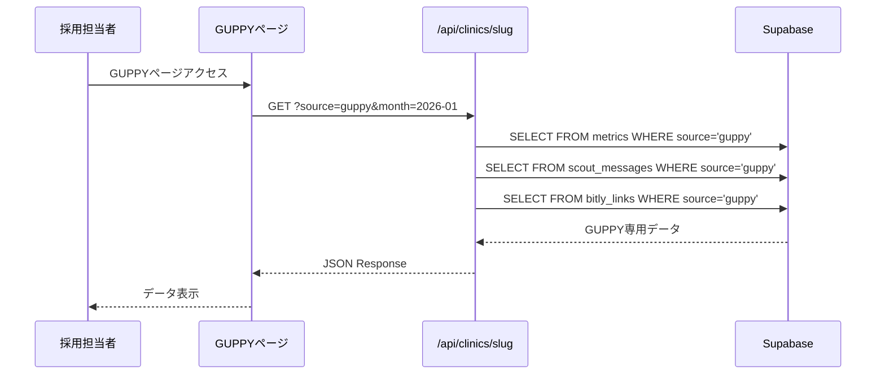

# Technical Design: guppy-data-fix

## Overview

**Purpose**: GUPPYダッシュボード詳細画面でデータが正しく表示されるよう、APIにソースフィルタリング機能を追加する。

**Users**: 採用担当者がGUPPYページで日別メトリクス、サマリー、スカウトデータを確認する。

**Impact**: 既存の`/api/clinics/[slug]`エンドポイントに`source`パラメータを追加し、媒体別のデータフィルタリングを実現する。

### Goals
- GUPPYページでGUPPY媒体のデータのみを正確に表示
- 後方互換性を維持しながらAPIを拡張
- 既存の`admin/clinics`パターンを踏襲した一貫性のある実装

### Non-Goals
- 新規GUPPY専用APIの作成（将来検討）
- データベーススキーマの変更
- 他の媒体ページ（JobMedley、Quacareer）の変更

## Architecture

### Existing Architecture Analysis

**現行アーキテクチャの制約**:
- `/api/clinics/[slug]`は汎用エンドポイントとして設計されている
- `metrics`、`scout_messages`、`bitly_links`テーブルは複数媒体で共有
- `source`カラムが存在するがフィルタリングに使用されていない

**既存の拡張ポイント**:
- クエリパラメータ（`month`、`job_type`）による既存フィルタ機構
- Supabaseクエリビルダーのチェーン可能なフィルタ

**技術的負債**:
- 媒体固有ロジックが汎用APIに集中（許容範囲内）

### Architecture Pattern & Boundary Map

```mermaid
graph TB
    subgraph Frontend
        GuppyPage[GUPPY Page]
    end

    subgraph API Layer
        ClinicAPI[/api/clinics/slug]
    end

    subgraph Database
        Metrics[metrics table]
        Scout[scout_messages table]
        Bitly[bitly_links table]
    end

    GuppyPage -->|source=guppy| ClinicAPI
    ClinicAPI -->|.eq source guppy| Metrics
    ClinicAPI -->|.eq source guppy| Scout
    ClinicAPI -->|.eq source guppy| Bitly
```

**Architecture Integration**:
- **Selected pattern**: 既存API拡張（クエリパラメータ追加）
- **Domain boundaries**: APIレイヤーでソースフィルタリングを一元管理
- **Existing patterns preserved**: Supabaseクエリビルダー、クエリパラメータによるフィルタ
- **New components rationale**: なし（既存コンポーネントの拡張のみ）
- **Steering compliance**: Next.js App Router規約、TypeScript strict mode維持

### Technology Stack

| Layer | Choice / Version | Role in Feature | Notes |
|-------|------------------|-----------------|-------|
| Frontend | Next.js 16.x / React 19.x | GUPPYページからAPIリクエスト送信 | `source=guppy`パラメータ追加 |
| Backend | Next.js Route Handler | ソースフィルタリングロジック実装 | 既存route.ts拡張 |
| Data | Supabase (PostgreSQL) | `source`カラムによるフィルタリング | 既存スキーマ使用 |

## System Flows

### データ取得フロー



**Key Decisions**:
- `source`パラメータが省略された場合は従来動作（全ソースまたはフィルタなし）を維持
- 月選択とソースフィルタは独立して動作

## Requirements Traceability

| Requirement | Summary | Components | Interfaces | Flows |
|-------------|---------|------------|------------|-------|
| 1.1-1.4 | APIソースフィルタリング | ClinicDetailAPI | API Contract | データ取得フロー |
| 2.1-2.4 | 日別データ表示 | GuppyPage | - | データ取得フロー |
| 3.1-3.4 | サマリー集計 | ClinicDetailAPI | API Contract | データ取得フロー |
| 4.1-4.4 | スカウトデータ表示 | ClinicDetailAPI, GuppyPage | API Contract | データ取得フロー |
| 5.1-5.3 | 利用可能月リスト | ClinicDetailAPI | API Contract | データ取得フロー |
| 6.1-6.4 | エラーハンドリング | ClinicDetailAPI, GuppyPage | API Contract | - |

## Components and Interfaces

| Component | Domain/Layer | Intent | Req Coverage | Key Dependencies | Contracts |
|-----------|--------------|--------|--------------|------------------|-----------|
| ClinicDetailAPI | Backend/API | 媒体別データ取得 | 1, 3, 4, 5, 6 | Supabase (P0) | API |
| GuppyPage | Frontend/UI | GUPPY媒体データ表示 | 2, 6 | ClinicDetailAPI (P0) | - |

### Backend / API Layer

#### ClinicDetailAPI

| Field | Detail |
|-------|--------|
| Intent | クリニック詳細データをソース別にフィルタリングして返却 |
| Requirements | 1.1, 1.2, 1.3, 1.4, 3.1, 3.2, 3.3, 3.4, 4.1, 4.2, 4.3, 4.4, 5.1, 5.2, 5.3, 6.2, 6.3 |

**Responsibilities & Constraints**
- ソースパラメータに基づいてメトリクス、スカウト、Bitlyデータをフィルタリング
- 後方互換性維持：`source`パラメータなしは従来動作
- バリデーション：無効な`source`値はエラー返却

**Dependencies**
- Outbound: Supabase — データベースクエリ (P0)

**Contracts**: API [x]

##### API Contract

| Method | Endpoint | Request | Response | Errors |
|--------|----------|---------|----------|--------|
| GET | /api/clinics/[slug] | `?source=guppy&month=YYYY-MM&job_type=dr` | ClinicDataResponse | 400, 404, 503, 500 |

**Request Parameters**:
```typescript
interface ClinicDetailRequest {
  slug: string;              // パスパラメータ（必須）
  source?: Source;           // 'guppy' | 'jobmedley' | 'quacareer'（任意）
  month?: string;            // 'YYYY-MM'形式（任意）
  job_type?: JobType;        // 'dr' | 'dh' | 'da'（任意）
}
```

**Response Schema**:
```typescript
interface ClinicDataResponse {
  clinic: {
    id: string;
    name: string;
    slug: string;
    guppy_profile_completeness?: number | null;
    guppy_independence_support?: boolean | null;
    guppy_profile_updated_at?: string | null;
    guppy_profile_scraped_at?: string | null;
  };
  metrics: DailyMetrics[];
  summary: {
    totalDisplayCount: number;
    totalViewCount: number;
    totalRedirectCount: number;
    totalApplicationCount: number;
    viewRate: number;
    applicationRate: number;
  };
  scoutMessages: ScoutMessage[];
  bitlyClicks: BitlyClick[];
  bitlyLinkClicks: BitlyLinkClick[];
  availableMonths: string[];
  currentMonth: string | null;
}
```

**Error Responses**:
| Code | Condition | Response |
|------|-----------|----------|
| 400 | 無効な`source`値 | `{ error: 'Invalid source parameter' }` |
| 404 | クリニック未発見 | `{ error: 'Clinic not found' }` |
| 503 | DB未設定 | `{ error: 'Database not configured' }` |
| 500 | 内部エラー | `{ error: 'Internal server error' }` |

**Implementation Notes**
- **Integration**: 既存クエリビルダーに`.eq('source', source)`を追加
- **Validation**: `source`パラメータは`Source`型でバリデーション
- **Risks**: なし（既存パターンの拡張）

### Frontend / UI Layer

#### GuppyPage

| Field | Detail |
|-------|--------|
| Intent | GUPPY媒体のデータを表示するダッシュボードページ |
| Requirements | 2.1, 2.2, 2.3, 2.4, 6.1, 6.4 |

**Responsibilities & Constraints**
- APIリクエストに`source=guppy`パラメータを付与
- 既存のUI構造・レイアウトは維持

**Dependencies**
- Outbound: ClinicDetailAPI — データ取得 (P0)

**Contracts**: なし（API呼び出し変更のみ）

**Implementation Notes**
- **Integration**: `fetch`URL に`source=guppy`を追加
- **Validation**: 既存のローディング・エラー表示を継続使用
- **Risks**: なし

## Data Models

### Domain Model

**変更なし** — 既存の`DailyMetrics`、`ScoutMessage`、`BitlyClick`エンティティをそのまま使用。

### Logical Data Model

**既存テーブル構造（変更なし）**:

```
metrics
├── id: uuid (PK)
├── clinic_id: uuid (FK)
├── date: date
├── source: text ('guppy' | 'jobmedley' | 'quacareer')  ← フィルタ対象
├── job_type: text (nullable)
├── display_count, view_count, redirect_count, application_count: integer
└── search_rank: integer (nullable)

scout_messages
├── id: uuid (PK)
├── clinic_id: uuid (FK)
├── date: date
├── source: text  ← フィルタ対象
├── sent_count, reply_count, open_count: integer
└── created_at, updated_at: timestamp

bitly_links
├── id: uuid (PK)
├── clinic_id: uuid (FK)
├── source: text  ← フィルタ対象
├── bitlink, link_id, label, long_url: text
└── created_at, updated_at: timestamp
```

**インデックス推奨**:
- `metrics(clinic_id, source, date)` — ソース別月次クエリ最適化
- `scout_messages(clinic_id, source, date)` — 同上
- `bitly_links(clinic_id, source)` — ソース別リンク取得

## Error Handling

### Error Strategy

既存のエラーハンドリングパターンを継続使用。追加バリデーションとして`source`パラメータの検証を行う。

### Error Categories and Responses

**User Errors (4xx)**:
- 400: 無効な`source`値 → `{ error: 'Invalid source parameter. Valid values: guppy, jobmedley, quacareer' }`
- 404: クリニック未発見 → 既存の404レスポンス

**System Errors (5xx)**:
- 503: DB未設定 → 既存の503レスポンス
- 500: 内部エラー → 既存の500レスポンス

### Monitoring

既存の`console.error`ロギングを継続使用。

## Testing Strategy

### Unit Tests
- `source`パラメータのバリデーションロジック
- クエリビルダーへの`source`フィルタ追加確認

### Integration Tests
- `source=guppy`でGUPPYデータのみ返却されることを確認
- `source`なしで従来動作（後方互換性）を確認
- 無効な`source`値で400エラー返却を確認

### E2E Tests
- GUPPYページアクセス → 日別データ表示確認
- 月選択 → 選択月のGUPPYデータ表示確認
- データなし → 「データがありません」メッセージ表示確認
