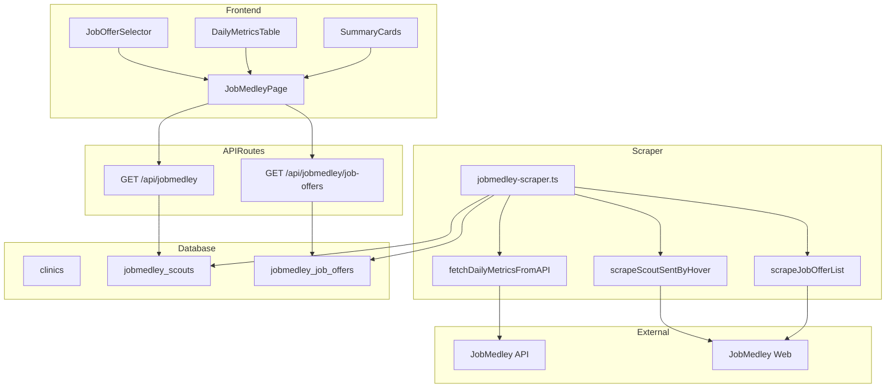
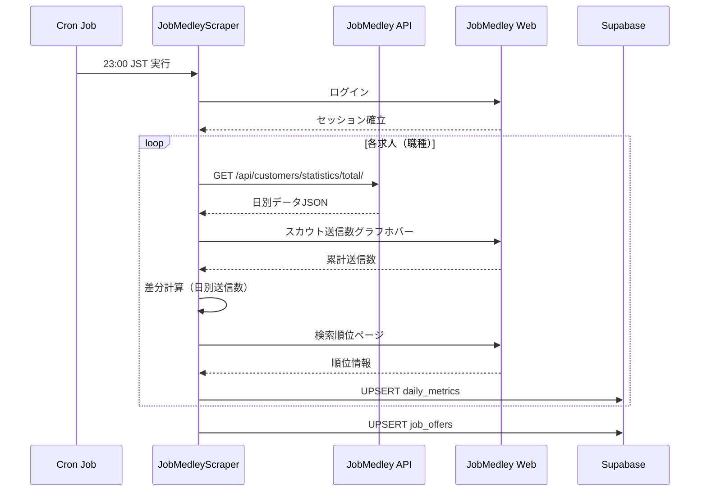

# Design Document

## Overview
**Purpose**: ジョブメドレーの分析データをAPI + スクレイピングのハイブリッド方式で日別取得し、8項目×31行のテーブル形式で表示する機能を提供する。

**Users**: クリニック管理者が求人媒体のパフォーマンスを日別・求人別に把握するために使用。

**Impact**: 既存の月次集計表示から日別詳細表示へ拡張。既存`jobmedley_scouts`テーブルを拡張し、新規`jobmedley_job_offers`テーブルを追加。

### Goals
- ジョブメドレーAPIから日別データ（閲覧数・応募数）を安定取得
- スカウト送信数をホバー差分方式で自動計測
- 求人（職種）別の切り替え表示
- 8項目の日別テーブル + 求人別サマリーカード表示

### Non-Goals
- 過去月データの遡及取得（現在月のみ対応）
- リアルタイムデータ更新（日次バッチのみ）
- 複数クリニックの一括表示

## Architecture

### Existing Architecture Analysis
- **既存パターン**: Playwright + Supabase + Next.js App Router
- **既存境界**: スクレイパー（lib）→ API Route → React Client Component
- **維持すべき統合点**: ログイン機構、Supabase接続、テーマ切替Hook
- **対処する技術的負債**: ホバー方式からAPI方式への移行

### Architecture Pattern & Boundary Map



**Architecture Integration**:
- Selected pattern: レイヤードアーキテクチャ（既存踏襲）
- Domain boundaries: スクレイパー / API / UI の3層分離を維持
- Existing patterns preserved: Playwright, Supabase, Next.js App Router
- New components rationale: 求人別データ対応のため`jobmedley_job_offers`テーブル追加

### Technology Stack

| Layer | Choice / Version | Role in Feature | Notes |
|-------|------------------|-----------------|-------|
| Frontend | Next.js 14 / React 18 | 日別テーブル・求人切替UI | Client Component |
| Backend | Next.js API Routes | データ取得API | 既存パターン踏襲 |
| Scraper | Playwright | ログイン・ホバー取得 | 既存活用 |
| Data | Supabase (PostgreSQL) | 日別データ永続化 | RLS有効 |
| Cron | Vercel Cron / 外部 | 日次バッチ実行 | 23:00 JST |

## System Flows

### 日次スクレイピングフロー



**Key Decisions**:
- 23:00 JST実行で当日データ確定
- 求人ごとにループ処理（求人選択→データ取得）
- 累計→日別の差分計算はスクレイパー側で実施

## Requirements Traceability

| Requirement | Summary | Components | Interfaces | Flows |
|-------------|---------|------------|------------|-------|
| 1.1-1.5 | 日別データAPI取得 | APIFetcher | fetchDailyMetricsFromAPI | 日次スクレイピング |
| 2.1-2.4 | 求人リスト取得 | JobOfferScraper | scrapeJobOfferList | 日次スクレイピング |
| 3.1-3.3 | 求人別サマリー取得 | JobOfferScraper | scrapeJobOfferSummary | 日次スクレイピング |
| 4.1-4.5 | スカウト送信数自動計測 | HoverScraper | scrapeScoutSentByHover | 日次スクレイピング |
| 5.1-5.5 | 検索順位取得 | RankScraper | scrapeSearchRank | 日次スクレイピング |
| 6.1-6.3 | DBスキーマ拡張 | Database | - | マイグレーション |
| 7.1-7.4 | 日別テーブルUI | DailyMetricsTable | - | - |
| 8.1-8.4 | 求人切り替え機能 | JobOfferSelector | - | - |
| 9.1-9.4 | サマリーカード表示 | SummaryCards | - | - |
| 10.1-10.4 | APIルート拡張 | APIJobmedley | GET /api/jobmedley | - |

## Components and Interfaces

| Component | Domain/Layer | Intent | Req Coverage | Key Dependencies | Contracts |
|-----------|--------------|--------|--------------|------------------|-----------|
| APIFetcher | Scraper | APIから日別データ取得 | 1.1-1.5 | Playwright (P0) | Service |
| HoverScraper | Scraper | ホバーで送信数累計取得 | 4.1-4.5 | Playwright (P0) | Service |
| JobOfferScraper | Scraper | 求人リスト・サマリー取得 | 2.1-2.4, 3.1-3.3 | Playwright (P0) | Service |
| DailyMetricsTable | UI | 日別8項目テーブル表示 | 7.1-7.4 | API (P0) | State |
| JobOfferSelector | UI | 求人選択ドロップダウン | 8.1-8.4 | API (P0) | State |
| SummaryCards | UI | 求人別サマリー表示 | 9.1-9.4 | API (P0) | State |
| APIJobmedley | API | 日別データ返却 | 10.1-10.4 | Supabase (P0) | API |

### Scraper Layer

#### APIFetcher

| Field | Detail |
|-------|--------|
| Intent | ジョブメドレーAPIから日別メトリクスを取得 |
| Requirements | 1.1, 1.2, 1.3, 1.4, 1.5 |

**Responsibilities & Constraints**
- ログイン後のセッションを利用してAPI呼び出し
- `period_type=2`で月間データ取得
- JSON解析とデータ変換

**Dependencies**
- Inbound: JobMedleyScraper — 呼び出し元 (P0)
- External: JobMedley API — データソース (P0)

**Contracts**: Service [x]

##### Service Interface
```typescript
interface DailyMetricData {
  date: string;  // "YYYY-MM-DD"
  pageViewCount: number;
  applicationCountTotal: number;
  scoutApplicationCount: number;
}

interface APIFetcherService {
  fetchDailyMetrics(
    page: Page,
    jobOfferId: string | null,
    year: number,
    month: number
  ): Promise<DailyMetricData[]>;
}
```
- Preconditions: ログイン済みPage、有効なセッション
- Postconditions: 日別データ配列（最大31件）
- Invariants: 日付はユニーク

#### HoverScraper

| Field | Detail |
|-------|--------|
| Intent | グラフホバーで累計送信数を取得し差分計算 |
| Requirements | 4.1, 4.2, 4.3, 4.4, 4.5 |

**Responsibilities & Constraints**
- スカウト送信数グラフの各日ドットをホバー
- ツールチップから累計値を抽出
- 前日との差分で日別送信数を算出
- 月初・リセット検知

**Dependencies**
- Inbound: JobMedleyScraper — 呼び出し元 (P0)
- External: JobMedley Web — グラフ表示 (P0)

**Contracts**: Service [x]

##### Service Interface
```typescript
interface ScoutSentData {
  date: string;
  cumSentCount: number;  // 累計
  sentCount: number;     // 日別（差分）
}

interface HoverScraperService {
  scrapeScoutSentCumulative(
    page: Page,
    jobOfferId: string | null,
    year: number,
    month: number
  ): Promise<ScoutSentData[]>;
}
```
- Preconditions: 分析ページ表示済み、求人選択済み
- Postconditions: 累計・日別送信数の配列
- Invariants: `sentCount = cumSent[d] - cumSent[d-1]`（月初・リセット時を除く）

#### JobOfferScraper

| Field | Detail |
|-------|--------|
| Intent | 求人リストとサマリーデータを取得 |
| Requirements | 2.1, 2.2, 2.3, 3.1, 3.2, 3.3 |

**Responsibilities & Constraints**
- 検索欄サジェストから求人リスト取得
- 各求人選択時の8項目サマリー取得

**Dependencies**
- Inbound: JobMedleyScraper — 呼び出し元 (P0)
- External: JobMedley Web — サジェスト・詳細画面 (P0)

**Contracts**: Service [x]

##### Service Interface
```typescript
interface JobOffer {
  jobOfferId: string;
  name: string;
  hireCount: number;
  applicationCount: number;
  scoutApplicationCount: number;
  pageViewCount: number;
  daysSinceUpdate: number;
  photoCount: number;
  featureTags: string[];
  scoutSentCount: number;
}

interface JobOfferScraperService {
  scrapeJobOfferList(page: Page): Promise<{ jobOfferId: string; name: string }[]>;
  scrapeJobOfferSummary(page: Page, jobOfferId: string): Promise<JobOffer>;
}
```

### API Layer

#### APIJobmedley (拡張)

| Field | Detail |
|-------|--------|
| Intent | 日別メトリクスと求人データを返却 |
| Requirements | 10.1, 10.2, 10.3, 10.4 |

**Responsibilities & Constraints**
- クエリパラメータで期間・求人フィルタ
- 全求人合算のデフォルト動作
- 率計算用の生値を返却

**Dependencies**
- Inbound: Frontend UI — データ取得 (P0)
- External: Supabase — データストア (P0)

**Contracts**: API [x]

##### API Contract
| Method | Endpoint | Request | Response | Errors |
|--------|----------|---------|----------|--------|
| GET | /api/jobmedley | `year, month, slug, job_offer_id?` | DailyMetricsResponse | 400, 404, 500 |
| GET | /api/jobmedley/job-offers | `slug` | JobOffersResponse | 400, 404, 500 |

```typescript
interface DailyMetric {
  date: string;
  scoutSentCount: number;
  scoutApplicationCount: number;
  scoutApplicationRate: number | null;  // null if division by zero
  searchRank: number | null;
  pageViewCount: number;
  applicationCountJobPage: number;
  jobPageApplicationRate: number | null;
}

interface DailyMetricsResponse {
  dailyData: DailyMetric[];
  summary: JobOfferSummary | null;
  jobOffers: { jobOfferId: string; name: string }[];
  scrapedAt: string | null;
}
```

### UI Layer

#### DailyMetricsTable

| Field | Detail |
|-------|--------|
| Intent | 8項目×31行の日別テーブル表示 |
| Requirements | 7.1, 7.2, 7.3, 7.4 |

**Implementation Notes**
- 率計算はフロントエンドで実施（分母0対応）
- ゼロ除算時は「—」表示
- ダーク/ライトモード対応

#### JobOfferSelector

| Field | Detail |
|-------|--------|
| Intent | 求人選択ドロップダウン |
| Requirements | 8.1, 8.2, 8.3, 8.4 |

**Implementation Notes**
- デフォルト「全求人合算」
- 選択変更でAPIリクエスト発火

#### SummaryCards

| Field | Detail |
|-------|--------|
| Intent | 求人別8項目サマリーカード |
| Requirements | 9.1, 9.2, 9.3, 9.4 |

**Implementation Notes**
- 既存SummaryCardコンポーネントを拡張
- 特徴タグはバッジ表示

## Data Models

### Physical Data Model

#### jobmedley_scouts（拡張）

```sql
ALTER TABLE jobmedley_scouts
  ADD COLUMN IF NOT EXISTS job_offer_id TEXT,
  ADD COLUMN IF NOT EXISTS page_view_count INTEGER DEFAULT 0,
  ADD COLUMN IF NOT EXISTS application_count_total INTEGER DEFAULT 0,
  ADD COLUMN IF NOT EXISTS scout_application_count INTEGER DEFAULT 0,
  ADD COLUMN IF NOT EXISTS cum_scout_sent_count INTEGER DEFAULT 0,
  ADD COLUMN IF NOT EXISTS search_rank INTEGER;

-- ユニーク制約変更
ALTER TABLE jobmedley_scouts DROP CONSTRAINT IF EXISTS jobmedley_scouts_clinic_id_date_key;
ALTER TABLE jobmedley_scouts ADD CONSTRAINT jobmedley_scouts_clinic_job_date_key
  UNIQUE (clinic_id, job_offer_id, date);

CREATE INDEX IF NOT EXISTS idx_jobmedley_scouts_job_offer ON jobmedley_scouts(job_offer_id);
```

#### jobmedley_job_offers（新規）

```sql
CREATE TABLE IF NOT EXISTS jobmedley_job_offers (
  id UUID DEFAULT gen_random_uuid() PRIMARY KEY,
  clinic_id UUID REFERENCES clinics(id) ON DELETE CASCADE NOT NULL,
  job_offer_id TEXT NOT NULL,
  name TEXT NOT NULL,
  hire_count INTEGER DEFAULT 0,
  application_count INTEGER DEFAULT 0,
  scout_application_count INTEGER DEFAULT 0,
  page_view_count INTEGER DEFAULT 0,
  days_since_update INTEGER DEFAULT 0,
  photo_count INTEGER DEFAULT 0,
  feature_tags TEXT[] DEFAULT '{}',
  scout_sent_count INTEGER DEFAULT 0,
  scraped_at TIMESTAMP WITH TIME ZONE DEFAULT NOW(),
  created_at TIMESTAMP WITH TIME ZONE DEFAULT NOW(),
  updated_at TIMESTAMP WITH TIME ZONE DEFAULT NOW(),
  UNIQUE(clinic_id, job_offer_id)
);

CREATE INDEX IF NOT EXISTS idx_jobmedley_job_offers_clinic ON jobmedley_job_offers(clinic_id);
```

### Data Contracts & Integration

**API Response Schema**
```typescript
// 率計算: フロントエンド側で実施
// scoutApplicationRate = scoutApplicationCount / scoutSentCount
// jobPageApplicationRate = applicationCountJobPage / pageViewCount

interface DailyMetricRow {
  date: string;
  sent_count: number;           // scout_sent_count
  cum_sent_count: number;       // cum_scout_sent_count
  scout_application_count: number;
  search_rank: number | null;
  page_view_count: number;
  application_count_total: number;
  // derived: application_count_job_page = application_count_total - scout_application_count
}
```

## Error Handling

### Error Categories and Responses
- **ログイン失敗**: ログ記録 → 処理スキップ → 次回リトライ
- **API失敗**: ログ記録 → ホバーフォールバック検討 → 処理継続
- **ホバー失敗**: 座標計算フォールバック → 0として記録
- **DB保存失敗**: ログ記録 → 処理継続

### Monitoring
- スクレイピング成功/失敗ログ（console.log/error）
- 取得データ件数ログ
- エラー発生時のスタックトレース

## Testing Strategy

### Unit Tests
- 差分計算ロジック（月初、通常、リセット検知）
- 率計算（ゼロ除算対応）
- 日付生成ロジック

### Integration Tests
- API呼び出し → DB保存フロー
- フロントエンド → API → レスポンス整合性

### E2E Tests
- 月選択 → テーブル更新
- 求人切り替え → データ切り替え
- ダーク/ライトモード切り替え

## Migration Strategy

1. **DBマイグレーション実行**
   - `jobmedley_scouts`カラム追加
   - `jobmedley_job_offers`テーブル作成
   - RLSポリシー追加

2. **スクレイパー更新デプロイ**
   - 新機能（API取得、ホバー差分）を有効化
   - 初回実行でデータ投入

3. **フロントエンド更新デプロイ**
   - 新UIコンポーネント有効化
   - 既存表示との互換性維持

**Rollback**: 各フェーズは独立してロールバック可能。DBカラム追加は既存機能に影響なし。
