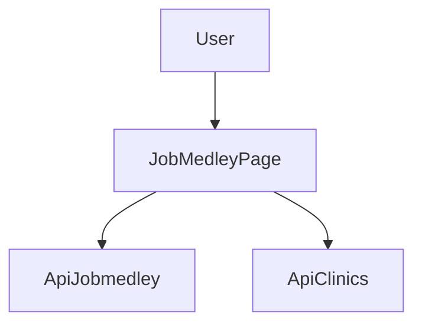

# Design Document

## Overview
本機能は、ジョブメドレー詳細画面で同一セクションが重複描画される問題を解消し、UIの一貫性を回復する。対象は既存の詳細ページであり、データ取得やAPI仕様は変更しない。
採用担当者が詳細画面を閲覧する際に、重複のないレイアウトで正確に情報を把握できる状態を目指す。

### Goals
- 重複セクションの排除と単一描画パスの確立
- ローディング/エラー表示の一貫性確保
- 既存の表示機能と導線の維持

### Non-Goals
- 新規データ取得APIの追加
- UIデザイン刷新や情報設計の大幅変更
- ジョブメドレー以外の媒体ページの改修

## Architecture

### Existing Architecture Analysis (if applicable)
- 既存ページは `src/app/clinic/[slug]/job-medley/page.tsx` に集中し、単一のクライアントコンポーネントで画面全体を描画している。
- データ取得は `/api/jobmedley` と `/api/clinics/[slug]` を使用する。
- 表示の分岐はページ内の状態管理で行われているため、重複描画は同一ページ内の条件分岐に起因しやすい。

### Architecture Pattern & Boundary Map

**Architecture Integration**:
- Selected pattern: 既存ページ内の単一描画パス維持
- Domain/feature boundaries: JobMedley詳細ページのUI表示責務に限定
- Existing patterns preserved: Next.js App Router, fetchによるデータ取得
- New components rationale: なし（既存ページ内の整理）
- Steering compliance: 既存構成と命名規則を維持

### Technology Stack

| Layer | Choice / Version | Role in Feature | Notes |
|-------|------------------|-----------------|-------|
| Frontend | Next.js App Router / React 19 | JobMedley詳細画面のUI描画 | 既存構成を維持 |
| Backend | Next.js Route Handler | `/api/jobmedley` 利用 | 既存APIを利用 |

## Requirements Traceability

| Requirement | Summary | Components | Interfaces | Flows |
|-------------|---------|------------|------------|-------|
| 1.1 | 主要セクションを1回のみ描画 | JobMedleyPage | UI | - |
| 1.2 | フィルタ変更時の重複防止 | JobMedleyPage | UI | - |
| 1.3 | 同一タイトル/ボタン群の重複排除 | JobMedleyPage | UI | - |
| 2.1 | ローディング表示の単一化 | JobMedleyPage | UI | - |
| 2.2 | エラー表示の単一化 | JobMedleyPage | UI | - |
| 2.3 | 成功時の表示クリーンアップ | JobMedleyPage | UI | - |
| 3.1 | 既存データ表示の維持 | JobMedleyPage | UI | - |
| 3.2 | 既存導線の維持 | JobMedleyPage | UI | - |

## Components and Interfaces

| Component | Domain/Layer | Intent | Req Coverage | Key Dependencies (P0/P1) | Contracts |
|-----------|--------------|--------|--------------|--------------------------|-----------|
| JobMedleyPage | UI | 詳細画面の単一描画パスを維持し重複を排除 | 1.1, 1.2, 1.3, 2.1, 2.2, 2.3, 3.1, 3.2 | `/api/jobmedley` (P0), `/api/clinics/[slug]` (P1) | State |

### UI Layer

#### JobMedleyPage

| Field | Detail |
|-------|--------|
| Intent | ジョブメドレー詳細画面の重複表示を排除し、状態に応じて1回だけ描画する |
| Requirements | 1.1, 1.2, 1.3, 2.1, 2.2, 2.3, 3.1, 3.2 |

**Responsibilities & Constraints**
- ページ内で単一の描画パスを保ち、同一セクションの複数描画を防止
- ローディング/エラー/成功の各状態で表示を排他的に切替
- 既存のサマリー/日別ログ/フィルタ UI を維持

**Dependencies**
- Inbound: User navigation — 画面表示 (P0)
- Outbound: `/api/jobmedley` — 詳細データ取得 (P0)
- Outbound: `/api/clinics/[slug]` — クリニック名/ID取得 (P1)

**Contracts**: Service [ ] / API [ ] / Event [ ] / Batch [ ] / State [x]

##### State Management
- State model: `loading`, `error`, `data` を単一経路で制御
- Persistence & consistency: 画面内ステートのみ、外部永続化なし
- Concurrency strategy: 最新のfetch結果を反映

**Implementation Notes**
- Integration: 既存のfetch処理とUIセクションの描画位置を整理
- Validation: 重複表示がないことと既存表示が欠けないことを確認
- Risks: 条件分岐の抜け漏れによる再発

## Data Models

### Domain Model
- 既存のジョブメドレー詳細表示のドメインを維持（変更なし）

### Logical Data Model
- 既存APIレスポンスの構造をそのまま利用（変更なし）

## Error Handling

### Error Strategy
- ローディング中はローディング表示のみを表示
- エラー時はエラーメッセージのみを表示
- 成功時はローディング/エラー表示を残さない

### Error Categories and Responses
- User Errors (4xx): 既存のAPIレスポンスに従いメッセージ表示
- System Errors (5xx): 取得失敗時のエラーメッセージ表示

### Monitoring
- 既存のログ/エラー表示に準拠

## Testing Strategy

- Unit Tests: 状態分岐（loading/error/success）の描画検証
- Integration Tests: フィルタ変更時に重複表示が発生しないことの確認
- E2E/UI Tests: 詳細画面の主要セクションが1回のみ表示されることの確認
