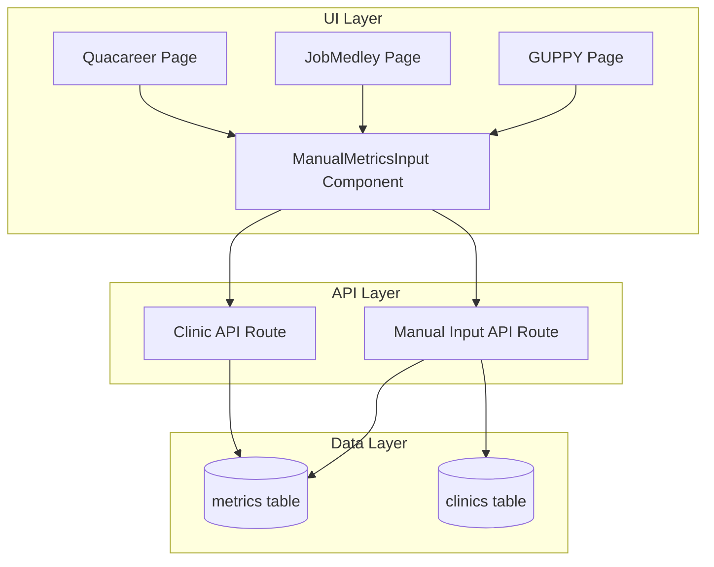
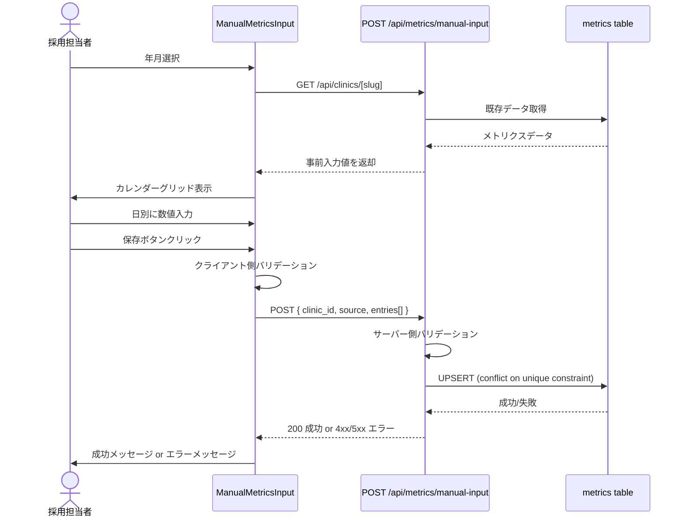
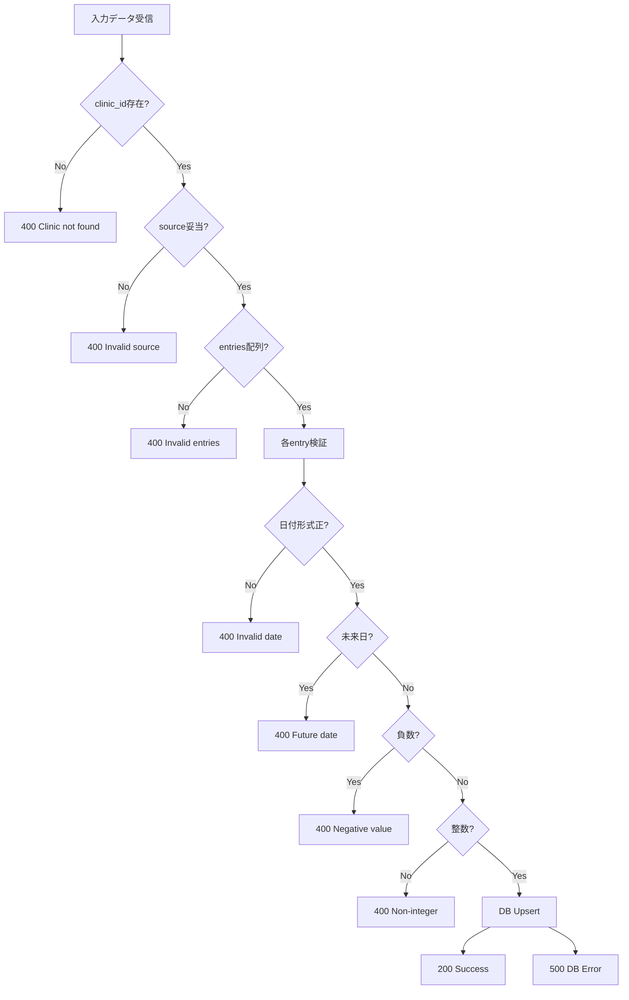
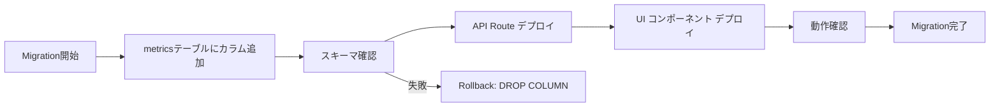

# Technical Design Document

## Overview

本機能は、採用メディア管理ダッシュボードにおいて、スカウト返信数と面接設定数を日別に手動入力できる機能を提供する。これらの指標は自動スクレイピングで取得できないため、採用担当者が手動で記録し、他のメトリクスと併せて可視化する必要がある。

**Purpose**: 採用担当者が日別のスカウト返信数と面接設定数を効率的に記録し、採用活動のKPIを完全に可視化できるようにする。

**Users**: 採用担当者（歯科クリニックの採用活動を管理する職員）が、GUPPY・ジョブメドレー・クオキャリアの3媒体すべてで利用する。

**Impact**: 既存の`metrics`テーブルに2カラムを追加し、3媒体の詳細ページに手動入力UIを追加する。既存のスクレイピングデータと共存する形で拡張する。

### Goals
- スカウト返信数と面接設定数を日別・媒体別・職種別に記録できる
- 既存のjobmedley_scoutsパターンと同様のカレンダー形式UIを提供
- 3媒体（GUPPY・ジョブメドレー・クオキャリア）すべてで統一されたUX
- 未入力と0件を区別できるデータモデル
- 既存のスクレイピングデータに影響を与えない

### Non-Goals
- スカウト返信数・面接設定数の自動取得（手動入力のみ）
- 採用決定数の手動入力（既存機能で対応済み）
- 過去データの一括インポート機能
- 入力履歴の監査ログ機能

## Architecture

### Existing Architecture Analysis

現在のシステムは以下の構造を持つ：

- **データ層**: Supabase（PostgreSQL）で3つの主要テーブル（`clinics`, `metrics`, `jobmedley_scouts`）を管理
- **API層**: Next.js 16 App Router の API Routes でRESTful APIを提供
- **UI層**: React 19サーバーコンポーネント/クライアントコンポーネントのハイブリッド
- **既存パターン**: `jobmedley_scouts`テーブルでスカウト送信数を記録、カレンダーUIで日別入力

**既存の拡張ポイント**:
- `metrics`テーブル: 複合ユニーク制約 `(clinic_id, date, source, job_type)` を持ち、新規カラム追加に対応可能
- カレンダーUI: `/clinic/[slug]/job-medley/page.tsx` で実装済み、再利用可能なパターン
- API upsertパターン: `/api/jobmedley/scout/route.ts` で実装済み、conflict解決ロジックを踏襲

### Architecture Pattern & Boundary Map



**Architecture Integration**:
- **選択パターン**: Feature-based layered architecture（既存パターンを踏襲）
- **Domain Boundaries**:
  - UI層は媒体別ページで分離、共通コンポーネントで統一
  - API層は責務別エンドポイントで分離（既存: `/api/clinics/[slug]`, 新規: `/api/metrics/manual-input`）
  - データ層は既存テーブル拡張（新規テーブル不要）
- **既存パターン維持**:
  - App Routerのサーバーコンポーネント/クライアントコンポーネント分離
  - Supabase Admin SDKによるサーバーサイドデータアクセス
  - TypeScript strict modeによる型安全性
- **新規コンポーネント追加理由**:
  - `ManualMetricsInput`: 3媒体で再利用するため、共通コンポーネント化が必要
  - `/api/metrics/manual-input`: 既存APIと責務を分離し、手動入力専用ロジックを集約
- **Steering準拠**: `.kiro/steering/structure.md` のコンポーネント配置原則に従う

### Technology Stack

| Layer | Choice / Version | Role in Feature | Notes |
|-------|------------------|-----------------|-------|
| Frontend | React 19.x | カレンダーUIとフォーム管理 | 既存。`'use client'`でクライアントコンポーネント化 |
| Framework | Next.js 16.x App Router | ページルーティングとAPIエンドポイント | 既存。サーバーコンポーネント優先 |
| Language | TypeScript 5.x (strict) | 型安全な実装 | 既存。`any`型禁止、厳格な型チェック |
| Data | Supabase PostgreSQL | metricsテーブル拡張 | 既存。カラム追加のみ |
| Date Handling | date-fns 3.x | 日付操作とフォーマット | 既存。月選択、日付リスト生成に使用 |

**Note**: 新規外部依存なし。すべて既存の技術スタックで実装可能。

## System Flows

### 手動入力フロー



**Key Decisions**:
- **事前入力**: 既存データがある場合は初期値として表示（UX向上）
- **Upsert**: 複合ユニーク制約でconflict解決、既存データを上書き
- **バリデーション**: クライアントで即時フィードバック、サーバーで厳格チェック

### データ検証フロー



## Requirements Traceability

| Requirement | Summary | Components | Interfaces | Flows |
|-------------|---------|------------|------------|-------|
| 1.1 | scout_reply_count カラム追加 | Migration Script | Physical Data Model | - |
| 1.2 | interview_count カラム追加 | Migration Script | Physical Data Model | - |
| 1.3 | 既存データ保持 | Migration Script | Migration SQL | - |
| 1.4 | ユニーク制約維持 | Migration Script | Physical Data Model | - |
| 1.5 | NULL許容 | Migration Script, Type Definitions | TypeScript Types | - |
| 2.1 | GUPPYカレンダーUI | GuppyPage, ManualMetricsInput | React Props | 手動入力フロー |
| 2.2 | ジョブメドレーカレンダーUI | JobMedleyPage, ManualMetricsInput | React Props | 手動入力フロー |
| 2.3 | クオキャリアカレンダーUI | QuacareerPage, ManualMetricsInput | React Props | 手動入力フロー |
| 2.4 | 年月選択 | ManualMetricsInput | React State | 手動入力フロー |
| 2.5 | 日別入力フィールド | ManualMetricsInput | React State | 手動入力フロー |
| 2.6 | 既存値事前入力 | ManualMetricsInput, Clinic API | API Response | 手動入力フロー |
| 2.7 | 非負整数のみ許可 | ManualMetricsInput | Input Validation | データ検証フロー |
| 2.8 | ローディング/成功表示 | ManualMetricsInput | React State | 手動入力フロー |
| 2.9 | エラーメッセージ表示 | ManualMetricsInput | API Error | 手動入力フロー |
| 3.1 | POST /api/metrics/manual-input | Manual Input API Route | API Contract | 手動入力フロー |
| 3.2 | リクエストボディ検証 | Manual Input API Route | Request Schema | データ検証フロー |
| 3.3 | clinic_id検証 | Manual Input API Route | DB Query | データ検証フロー |
| 3.4 | source検証 | Manual Input API Route | Enum Check | データ検証フロー |
| 3.5 | entry検証 | Manual Input API Route | Schema Validation | データ検証フロー |
| 3.6 | Upsert実行 | Manual Input API Route | Supabase SDK | 手動入力フロー |
| 3.7 | 成功レスポンス | Manual Input API Route | API Response | 手動入力フロー |
| 3.8 | バリデーションエラー | Manual Input API Route | 400 Response | データ検証フロー |
| 3.9 | DBエラー | Manual Input API Route | 500 Response | データ検証フロー |
| 4.1 | DailyMetrics型拡張 | Type Definitions | TypeScript Interface | - |
| 4.2 | DailyMetrics型拡張 | Type Definitions | TypeScript Interface | - |
| 4.3 | ManualInputEntry型定義 | Type Definitions | TypeScript Interface | - |
| 4.4 | ManualInputRequest型定義 | Type Definitions | TypeScript Interface | - |
| 4.5 | コンポーネントProps型定義 | Type Definitions | TypeScript Interface | - |
| 5.1 | 負数拒否 | Manual Input API Route | Validation Logic | データ検証フロー |
| 5.2 | 非整数拒否 | Manual Input API Route | Validation Logic | データ検証フロー |
| 5.3 | 未来日拒否 | Manual Input API Route | Date Validation | データ検証フロー |
| 5.4 | 日付フォーマット検証 | Manual Input API Route | Regex Validation | データ検証フロー |
| 5.5 | 重複防止 | Supabase Upsert | Unique Constraint | 手動入力フロー |
| 5.6 | updated_at更新 | Manual Input API Route | DB Timestamp | 手動入力フロー |
| 6.1 | カレンダーグリッドレイアウト | ManualMetricsInput | React Component | - |
| 6.2 | 月/年ナビゲーション | ManualMetricsInput | React State | - |
| 6.3 | 保存ボタン配置 | ManualMetricsInput | React Component | - |
| 6.4 | ローディング表示 | ManualMetricsInput | React State | - |
| 6.5 | 成功/エラーメッセージ | ManualMetricsInput | React State | - |
| 7.1 | 一覧でscout_reply_count表示 | Clinic List API | API Response | - |
| 7.2 | 一覧でinterview_count表示 | Clinic List API | API Response | - |
| 7.3 | 既存メトリクスと併記 | Clinic List UI | React Component | - |
| 7.4 | NULL値表示 | Clinic List UI | Conditional Rendering | - |

## Components and Interfaces

### Summary Table

| Component | Domain/Layer | Intent | Req Coverage | Key Dependencies (P0/P1) | Contracts |
|-----------|--------------|--------|--------------|--------------------------|-----------|
| ManualMetricsInput | UI / Client Component | カレンダー形式の手動入力UI | 2.1-2.9, 6.1-6.5 | Manual Input API (P0) | State, Props |
| Manual Input API Route | API / Server | 手動入力データ保存 | 3.1-3.9, 5.1-5.6 | Supabase (P0), Clinics Table (P0) | API |
| Migration Script | Data / Schema | metricsテーブル拡張 | 1.1-1.5 | PostgreSQL (P0) | Batch |
| Type Definitions | Shared / Types | TypeScript型定義更新 | 4.1-4.5 | - | Service |

### UI Layer

#### ManualMetricsInput

| Field | Detail |
|-------|--------|
| Intent | 3媒体で共通利用するカレンダー形式の日別入力UI |
| Requirements | 2.1, 2.2, 2.3, 2.4, 2.5, 2.6, 2.7, 2.8, 2.9, 6.1, 6.2, 6.3, 6.4, 6.5 |

**Responsibilities & Constraints**
- 年月選択、日別入力フィールド、保存ボタンを提供
- クライアント側バリデーション（非負整数、入力値の型チェック）
- API呼び出しとローディング/エラー状態の管理
- 既存データの事前入力（初回ロード時にAPIから取得）

**Dependencies**
- Outbound: `/api/metrics/manual-input` — データ保存 (P0)
- Outbound: `/api/clinics/[slug]` — 既存データ取得 (P1)
- External: React 19 Hooks — 状態管理 (P0)
- External: date-fns — 日付操作 (P1)

**Contracts**: State [x] / Props [x]

##### Props Interface
```typescript
interface ManualMetricsInputProps {
  clinicId: string;
  source: 'guppy' | 'jobmedley' | 'quacareer';
  isDark: boolean; // テーマ対応
  initialYear?: number; // デフォルト: 現在年
  initialMonth?: number; // デフォルト: 現在月
}
```

##### State Management
- **State Model**:
  ```typescript
  const [selectedYear, setSelectedYear] = useState<number>(initialYear ?? new Date().getFullYear());
  const [selectedMonth, setSelectedMonth] = useState<number>(initialMonth ?? new Date().getMonth() + 1);
  const [scoutReplyInputs, setScoutReplyInputs] = useState<Record<string, number>>({});
  const [interviewInputs, setInterviewInputs] = useState<Record<string, number>>({});
  const [saving, setSaving] = useState(false);
  const [saveMessage, setSaveMessage] = useState<{ type: 'success' | 'error'; text: string } | null>(null);
  ```
- **Persistence**: APIへのPOST後、サーバー側でDB永続化
- **Concurrency**: 複数ユーザーの同時編集は考慮しない（last-write-wins）

**Implementation Notes**
- **Integration**: 既存の`/clinic/[slug]/job-medley/page.tsx`パターンを参考に実装
- **Validation**: `input[type="number"]` + `min="0"` でクライアント側検証
- **Risks**: 未来日入力はクライアント側で防止できないため、サーバー側で厳格に検証

### API Layer

#### Manual Input API Route

| Field | Detail |
|-------|--------|
| Intent | 手動入力されたメトリクスデータをmetricsテーブルに保存 |
| Requirements | 3.1, 3.2, 3.3, 3.4, 3.5, 3.6, 3.7, 3.8, 3.9, 5.1, 5.2, 5.3, 5.4, 5.5, 5.6 |

**Responsibilities & Constraints**
- リクエストボディのバリデーション（schema, clinic_id, source, entries）
- 日付・数値の厳格な検証（未来日拒否、非負整数のみ許可）
- Upsertによる重複防止とタイムスタンプ更新
- エラーハンドリングと適切なHTTPステータスコード返却

**Dependencies**
- Outbound: `metrics` table — データ永続化 (P0)
- Outbound: `clinics` table — clinic_id存在確認 (P0)
- External: Supabase Admin SDK — DB操作 (P0)

**Contracts**: API [x]

##### API Contract

| Method | Endpoint | Request | Response | Errors |
|--------|----------|---------|----------|--------|
| POST | /api/metrics/manual-input | ManualInputRequest | { success: true, count: number } | 400 (バリデーション), 404 (clinic不存在), 500 (DB) |

**Request Schema**:
```typescript
interface ManualInputEntry {
  date: string; // YYYY-MM-DD
  scout_reply_count: number; // 0以上の整数
  interview_count: number; // 0以上の整数
}

interface ManualInputRequest {
  clinic_id: string; // UUID
  source: 'guppy' | 'jobmedley' | 'quacareer';
  entries: ManualInputEntry[];
}
```

**Response Schema**:
```typescript
// Success
{ success: true, count: number }

// Error
{ error: string }
```

**Validation Rules**:
- `clinic_id`: UUID形式、clinicsテーブルに存在すること
- `source`: `guppy`, `jobmedley`, `quacareer` のいずれか
- `entries`: 配列型、各要素が以下を満たす
  - `date`: YYYY-MM-DD形式、未来日でないこと
  - `scout_reply_count`: 0以上の整数
  - `interview_count`: 0以上の整数

**Preconditions**:
- Supabase Admin接続が確立されていること
- リクエストボディがJSON形式であること

**Postconditions**:
- 成功時: metricsテーブルに新規レコード挿入 or 既存レコード更新
- 失敗時: エラーログ出力、トランザクションロールバック

**Invariants**:
- 複合ユニーク制約 `(clinic_id, date, source, job_type)` を維持
- 既存のスクレイピングデータは変更しない（新規カラムのみ更新）

**Implementation Notes**
- **Integration**: 既存の`/api/jobmedley/scout/route.ts`パターンを踏襲
- **Validation**:
  - 日付検証: `new Date(date) <= new Date()` で未来日を拒否
  - 整数検証: `Number.isInteger(value) && value >= 0`
- **Risks**: Upsert時のrace conditionは許容（last-write-wins）

### Data Layer

#### Migration Script

| Field | Detail |
|-------|--------|
| Intent | metricsテーブルにscout_reply_count, interview_countカラムを追加 |
| Requirements | 1.1, 1.2, 1.3, 1.4, 1.5 |

**Responsibilities & Constraints**
- 既存データを保持したままカラム追加
- NULL許容カラムとして定義
- DEFAULT値なし（明示的なNULL）

**Dependencies**
- External: PostgreSQL — スキーマ変更 (P0)

**Contracts**: Batch [x]

##### Batch / Job Contract

**Trigger**: 手動実行（Supabaseダッシュボード or CLI）

**Input / Validation**: なし（DDLのみ）

**Output / Destination**: metricsテーブルスキーマ更新

**Idempotency & Recovery**:
- `IF NOT EXISTS` 条件で冪等性確保
- ロールバック: `ALTER TABLE metrics DROP COLUMN IF EXISTS scout_reply_count, interview_count;`

**Migration SQL**:
```sql
-- File: supabase/migrations/XXX_add_manual_metrics_columns.sql
ALTER TABLE metrics
  ADD COLUMN IF NOT EXISTS scout_reply_count INTEGER,
  ADD COLUMN IF NOT EXISTS interview_count INTEGER;

COMMENT ON COLUMN metrics.scout_reply_count IS 'スカウト返信数（手動入力）';
COMMENT ON COLUMN metrics.interview_count IS '面接設定数（手動入力）';
```

**Implementation Notes**
- **Integration**: 既存の複合ユニーク制約に影響なし
- **Validation**: マイグレーション実行後、`\d metrics` でカラム追加を確認
- **Risks**: なし（カラム追加のみ、既存データ変更なし）

## Data Models

### Domain Model

**Aggregates**:
- **Metrics Aggregate**: `(clinic_id, date, source, job_type)` の複合キーで識別される日別メトリクス

**Entities**:
- **DailyMetrics**: 1日1媒体1職種のメトリクス記録

**Value Objects**:
- **MetricValue**: `scout_reply_count`, `interview_count` は非負整数 or NULL

**Business Rules**:
- 未来日のメトリクスは記録不可
- 同一 `(clinic_id, date, source, job_type)` の重複は最新データで上書き
- NULL値は「未入力」を意味し、0は「0件入力済み」を意味する

**Invariants**:
- `scout_reply_count >= 0 OR scout_reply_count IS NULL`
- `interview_count >= 0 OR interview_count IS NULL`
- `date <= CURRENT_DATE`

### Logical Data Model

**Structure Definition**:
```
metrics (既存拡張)
  - id (UUID, PK)
  - clinic_id (UUID, FK → clinics.id)
  - date (DATE, NOT NULL)
  - source (TEXT, NOT NULL) ← 'guppy' | 'jobmedley' | 'quacareer'
  - job_type (TEXT, NULLABLE) ← 'dr' | 'dh' | 'da' | NULL
  - search_rank (INTEGER, NULLABLE)
  - display_count (INTEGER, DEFAULT 0)
  - view_count (INTEGER, DEFAULT 0)
  - redirect_count (INTEGER, DEFAULT 0)
  - application_count (INTEGER, DEFAULT 0)
  - scout_reply_count (INTEGER, NULLABLE) ← 新規
  - interview_count (INTEGER, NULLABLE) ← 新規
  - created_at (TIMESTAMP WITH TIME ZONE)
  - updated_at (TIMESTAMP WITH TIME ZONE)
  - UNIQUE (clinic_id, date, source, job_type)
```

**Consistency & Integrity**:
- **Transaction Boundary**: 単一レコードのupsert（原子性保証）
- **Cascading Rules**: clinic削除時に関連metricsレコードも削除（ON DELETE CASCADE）
- **Temporal Aspects**: `updated_at` はupsert時に自動更新

### Physical Data Model

**For Relational Databases** (PostgreSQL):

**Table Definition**:
```sql
-- 既存のmetricsテーブルに以下カラムを追加
scout_reply_count INTEGER,
interview_count INTEGER
```

**Indexes**: 既存の複合ユニークインデックスを利用（追加不要）
```sql
CREATE UNIQUE INDEX metrics_unique_key ON metrics (clinic_id, date, source, job_type);
```

**Constraints**:
- `scout_reply_count >= 0` (アプリケーションレベルで検証、DB制約なし)
- `interview_count >= 0` (アプリケーションレベルで検証、DB制約なし)

### Data Contracts & Integration

**API Data Transfer**:
```typescript
// POST /api/metrics/manual-input
Request: ManualInputRequest
Response: { success: true, count: number } | { error: string }
```

**TypeScript Type Definitions Update**:
```typescript
// src/types/index.ts
export interface DailyMetrics {
  id: string;
  clinic_id: string;
  date: string;
  source: Source;
  job_type: JobType | null;
  search_rank: number | null;
  display_count: number;
  view_count: number;
  redirect_count: number;
  application_count: number;
  scout_reply_count: number | null; // 新規
  interview_count: number | null; // 新規
  created_at: string;
  updated_at: string;
}

export interface ManualInputEntry {
  date: string;
  scout_reply_count: number;
  interview_count: number;
}

export interface ManualInputRequest {
  clinic_id: string;
  source: Source;
  entries: ManualInputEntry[];
}
```

## Error Handling

### Error Strategy

**エラー分類と対応方針**:
- **User Errors (4xx)**: バリデーションエラーは具体的なエラーメッセージを返却し、UI上で修正を促す
- **System Errors (5xx)**: DB接続エラーやクエリ失敗は一般的なエラーメッセージを返却し、ログに詳細を記録
- **Business Logic Errors (422)**: 未来日入力などのビジネスルール違反は明確なエラーメッセージで拒否

### Error Categories and Responses

**User Errors (4xx)**:
- **400 Bad Request**: `{ error: 'clinic_id is required' }` — clinic_id未指定
- **400 Bad Request**: `{ error: 'Invalid source: xxx' }` — source値が不正
- **400 Bad Request**: `{ error: 'entries must be an array' }` — entries型エラー
- **400 Bad Request**: `{ error: 'Invalid date format' }` — 日付形式エラー
- **400 Bad Request**: `{ error: 'Future dates are not allowed' }` — 未来日入力
- **400 Bad Request**: `{ error: 'Negative values are not allowed' }` — 負数入力
- **400 Bad Request**: `{ error: 'Non-integer values are not allowed' }` — 非整数入力
- **404 Not Found**: `{ error: 'Clinic not found' }` — clinic_id不存在

**System Errors (5xx)**:
- **500 Internal Server Error**: `{ error: 'Failed to save metrics data' }` — DB upsertエラー
- **503 Service Unavailable**: `{ error: 'Database not configured' }` — Supabase未接続

**クライアント側エラー表示**:
```typescript
if (res.ok) {
  setSaveMessage({ type: 'success', text: '保存しました' });
} else {
  const json = await res.json().catch(() => null);
  setSaveMessage({ type: 'error', text: json?.error || '保存に失敗しました' });
}
```

### Monitoring

- **Error Logging**: `console.error()` でサーバー側エラーをログ出力
- **Health Monitoring**: 既存のSupabaseダッシュボードで監視（追加監視不要）

## Testing Strategy

### Unit Tests
- バリデーション関数のテスト（日付、整数、source値）
- ManualMetricsInputコンポーネントの状態管理テスト
- API Routeのエラーハンドリングテスト

### Integration Tests
- APIエンドポイントのE2Eテスト（POST /api/metrics/manual-input）
- Upsertロジックの重複処理テスト
- 既存データ事前入力のフローテスト

### E2E/UI Tests
- カレンダーUIでの日別入力フロー
- 保存ボタンクリック → 成功メッセージ表示
- バリデーションエラー表示（未来日、負数入力）

### Performance/Load
- 31日分のエントリー一括保存の性能テスト
- 複数ユーザーの同時保存（race condition）

## Optional Sections

### Migration Strategy



**Phase Breakdown**:
1. **Phase 1**: マイグレーションスクリプト実行（カラム追加）
2. **Phase 2**: TypeScript型定義更新、ビルド確認
3. **Phase 3**: API Route実装、単体テスト
4. **Phase 4**: UI コンポーネント実装、統合テスト
5. **Phase 5**: 本番デプロイ、動作確認

**Rollback Triggers**:
- マイグレーション失敗（既存データ破損）
- ビルドエラー（型定義不整合）
- 本番で致命的なバグ発見

**Validation Checkpoints**:
- マイグレーション後: `\d metrics` でカラム確認
- デプロイ後: 各媒体ページでUI表示確認
- 保存後: Supabaseダッシュボードでデータ確認
